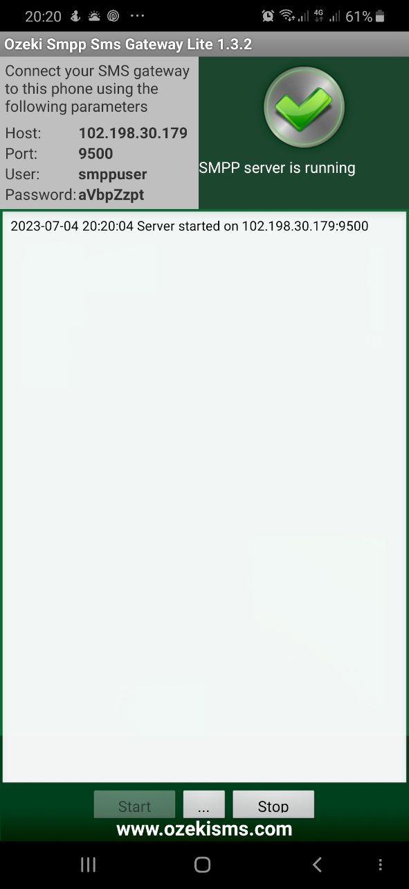
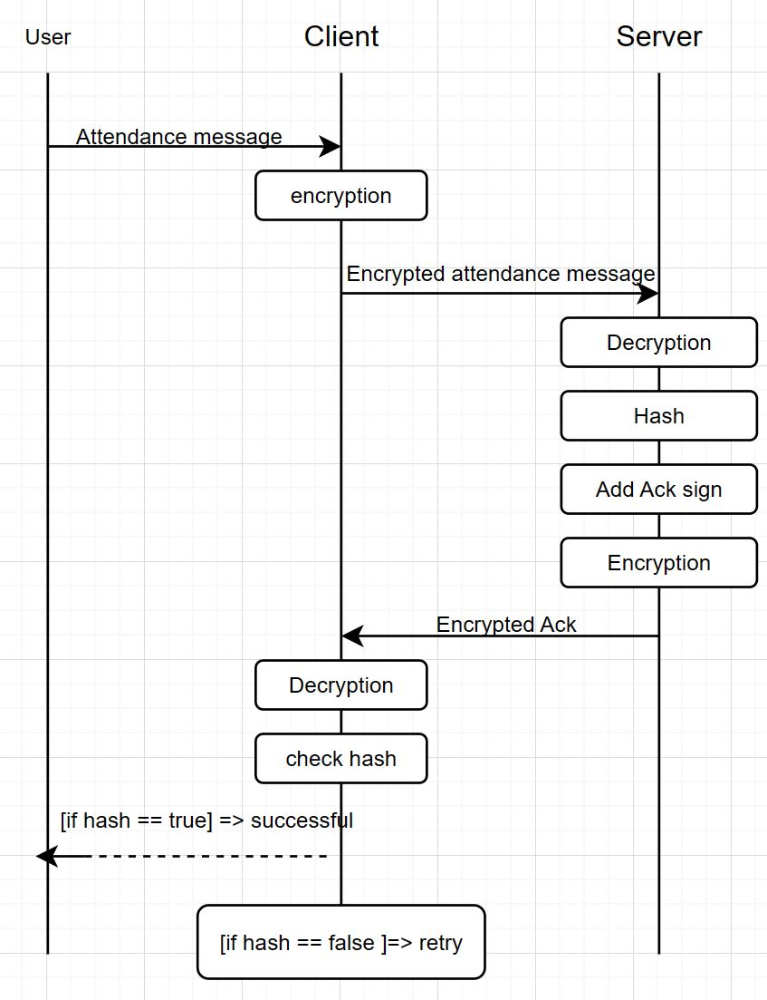

# SMPP_Server
در این پروژه قصد داریم یک سرور را با استفاده از یک GSM Modem قادر سازیم تا بتواند پیامک sms با استفاده از فرمت smpp protocl  ارسال و دریافت کند . محتوای این پیامک ها مربوط به سامانه ی حضور و غیاب کارمندان می باشد . بدین شکل که کاربر از طریق برنامه گوشی مربوط به این سامانه ، پیام ورود یا خروج خود به همراه ساعت آن را برای سرور ارسال می نماید . در سمت سرور ، حضور و غیاب کارمندان به همراه ساعت ورود یا خروج شان ثبت می گردد . هم چنین پروتکل و قواعد تعیین شده برای این سامانه امنیت را از نظر رمزگذاری و یکپارچگی و احراز هویت تامین می کند که در ادامه شیوه تعیین و پیاده سازی هر یک از بخش های اشاره شده با جزئیات مربوطه آورده شده است . 
# GSM Modem 
برای قادر ساختن سرور به دریافت و ارسال پیامک باید آن را به یک GSM Modem متصل کنیم و از طریق پروتکل smpp  با آن ارتباط برقرار کنیم .  GSM Modem یک نوع از modem برای شبکه های موبایل می باشد که sim card  درش قرار می گیرد و بدین طریق می تواند برای تماس صوتی و یا ارسال متن مورد استقبال قرار بگیرد . یک نوع از GSM Modem  را در شکل زیر می توانید مشاهده کنید. 


اما برای رفع نیاز راه اندازی سرور می توان از گوشی های امروزی نیز به عنوان GSM Modem  برای استفاده ی سرور استفاده کرد . به عبارتی ما گوشی را به عنوان یک GSM Modem  با پروتکل SMPP در نظر می گیریم . برای این کار نیاز است تا گوشی خود را به یک smpp gateway برای سرور تبدیل کنیم . برای این کار از برنامه های شبیه سازی گوشی به Smpp Gateway می توان استفاده کرد که در این پروژه از برنامه Ozeki Smpp Sms Gateway Lite  استفاده شده است . 



همان طور که در این تصویر مربوط به برنامه می توانید مشاهده کنید ، گوشی با استفاده از رمز عبور و نام کاربری قابل اتصال می باشد تا سرور بتواند به عنوان کاربر از آن استفاده کند و پیامک ارسال و دریافت کند . حال با جزئیات دقیق تر به پیاده سازی این اتصال می پردازیم .
# SMPP Gateway Connection 
برای متصل شدن به این GSM Modem  تحت پروتکل smpp  در سمت سرور ، ابتد باید از libaray موجود برای smpp  موارد لازم را import  کنیم 
```
import smpplib.client
import smpplib.gsm
import smpplib.consts
```
با تعریف کلاسی با عنوان SMPP_Message_handler ، یک تابع اولیه در آن برای اتصال تعریف می کنیم . که به شکل زیر است . در این تابع ابتدا با مشخصات داده شده به عنوان ورودی به آن ip , port اتصال برقرار می کنیم و سپس با استفاده از username , password  اتصال را می شناسانیم تا برقرار بماند و reject  نشود . سپس منتظر دریافت پیامک از سوی کاربران ( پیام ورود یا خروج ) می مانیم . در نهایت نیز اتصال را قطع می کنیم . لازم به ذکر است که در تابع receive_sms جزئیات بسیاری وجود دارد که در ادامه بدان می پردازیم و تنها کار آن دریافت پیام و نمایش آن نیست . 
```
class SMPP_Message_handler():
    def __init__(self):
        self.db = AttendanceDB()
....
....
....

    def send_and_receive_sms(self,host, port, username, password, src_addr):
        with smpplib.client.Client(host, port) as client:
            client.connect()
            client.bind_transceiver(system_id=username, password=password)
            self.receive_sms(client)
            client.unbind()
            client.disconnect()


smpp_handler = SMPP_Message_handler()
host = '192.168.1.143'
port = 9500
username = "smppuser"
password = "aVbpZzpt"
src_addr = '9102211824'
smpp_handler.send_and_receive_sms(host, port, username, password, src_addr)
```
حال که شیوه برقراری ارتباط را مشاهده کردیم ، قبل از ادامه بررسی کد پروتکل برنامه خود برای ارسال و دریافت پیامک و شیوه امنیت آن را توضیح می دهیم .
# Attendance SMPP Protocol 
شیوه کلی ارتباط بدین صورت است که ابتدا کاربر یک پیام حاوی ورود یا خروج همراه ساعت آن به سمت سرور می فرستد . این پیام بعد از رمز شدن توسط کلید داخلی برنامه ( که کانال امنی محسوب می شود ) توسط برنامه به سمت سرور فرستاده می شود . سرور بعد از دریافت آن ، آن را رمزگشایی می کند و محتوای آن را ذخیره می کند . سپس به عنوان ack  برای برنامه گوشی ( و کاربر ) همان پیام را ابتدا hash  می کند و سپس عبارتی با مقدار AFTSTC بدان اضافه می کند و کل این محتوا را رمز می کند و برای گوشی می فرستد . 
علت hash کردن محتوای پیام این است که اگر در وسط راه پیام تغییری کرده باشد و مرد میانی دخالتی کرده باشد ، گوشی با دریافت ack  و بررسی برابر بودن hash  پیام اولیه خودش و hash  دریافت شده متوجه این دخالت می شود و بنابراین دوباره پیام خود را به سمت سرور ارسال می کند . بدین شیوه اطمینان حاصل می کند که محتوای اصلی پیام تغییری نکرده باشد . هم چنین با استفاده از رمز کردن همه پیام های بین دو طرف ، امکان خواندن پیام ها توسط مرد میانی ( و نه تغییر آن ) را نیز از کاربر می گیریم . در تصویر زیر می توانید کل فرایند را مشاهده کنید .


حال که به کلیت فرایند پروتکل قراردادی و شیوه کارکرد آن پرداختیم ، کد آن را با جزئیات بیشتر بررسی می کنیم . 

# Protocol implementation
با توجه به توضیح کلی ارائه شده درباره پروتکل قراردادی ، سرور همواره در حال listening  است تا پیامکی از طرف کاربران دریافت و اطلاعات خود را بروز کرده و ack را برایشان بازگرداند . که در ادامه هر کدام از این بخش ها دقیق تر توضیح داده می شوند . 
## Attendance Database
ابتدا شیوه ذخیره وضعیت کاربران ، یعنی محتوای پیامی که فرستاده اند را بیان می کنیم . شیوه ذخیره سازی وضعیت کاربر ( ورود و یا خروج همراه با ساعت ) با استفاده از sqlite  صورت گرفته است . از آن جا که در این پروژه شیوه ذخیره سازی چندان موضوع مورد بحث نیست تنها به توضیح مختصری درباره کد زیر اکتفا می کنیم .
در این کد ، با ساخت شی از کلاس AttendanceDB  یک connection  به دیتابیس sqlite  برقرار می شود . جدولی که قصد داریم اطلاعات را در آن ذخیره کنیم شامل سه ستون می باشد که به ترتیب source_address ( همان شماره آن فرد ) ، status  یا وضعیت ( شامل ورود یا خروج ) و time  می باشد که ساعت ورود یا خروج را نشان می دهد .
در تابع insert_data  نیز پیام decrpyt شده به عنوان ورودی دریافت می شود و وضعیت آن در جدول توضیح داده شده ذخیره می شود . ( اگر کاربر در دیتایس باشد اطلاعاتش بروزرسانی می شود و اگر در دیتایس نباشد ، سطر جدید ساخته می شود )
```
class AttendanceDB():
    def __init__(self):
        self.conn = self.setup_database()

    def setup_database(self):
        conn = sqlite3.connect("attendance.db")
        cursor = conn.cursor()

        cursor.execute("""
        CREATE TABLE IF NOT EXISTS attendance (
            source_address TEXT PRIMARY KEY,
            status TEXT,
            time TEXT
        )
        """)

        conn.commit()
        return conn

    def insert_data(self,conn, decrypted_message, source_address):
        cursor = conn.cursor()

        cursor.execute("SELECT * FROM attendance WHERE source_address=?", (source_address,))
        record = cursor.fetchone()

        status = ""
        time_str = ""
        if "Arrival" in decrypted_message:
            status = "Arrival"
            time_str = decrypted_message.split("Arrival")[1]
        elif "Exit" in decrypted_message:
            status = "Exit"
            time_str = decrypted_message.split("Exit")[1]

        if record:
            cursor.execute("""
            UPDATE attendance SET status=?, time=? WHERE source_address=?
            """, (status, time_str, source_address))
        else:
            cursor.execute("""
            INSERT INTO attendance (source_address, status, time) VALUES (?, ?, ?)
            """, (source_address, status, time_str))

        conn.commit()
```

## Encryption
برای پیاده سازی این پروتکل قراردادی که در بخش منطق آن توضیح داده شد ، از رمزنگازی AES  استفاده شده است . این الگوریتم یکی از الگوریتم های ارتباطی متقارن می باشد که امروزه به شکل بسیار وسیعی استفاده می شود . توابع زیر برای فرایند رمزگذاری و رمزگشایی پیام ها تعریف شده اند . 
```
    def aes_encrypt(self,message, key):
        iv = b'\x00' * AES.block_size
        cipher = AES.new(key.encode("utf-8"), AES.MODE_CBC, iv=iv)
        ciphertext = cipher.encrypt(pad(message.encode("utf-8"), AES.block_size))
        return b64encode(ciphertext).decode('utf-8')

    def aes_decrypt(self,ciphertext, key):
        iv = b'\x00' * AES.block_size
        data = b64decode(ciphertext)
        cipher = AES.new(key.encode("utf-8"), AES.MODE_CBC, iv=iv)
        decrypted_data = cipher.decrypt(data)
        return unpad(decrypted_data, AES.block_size).decode('utf-8')

```
هم چنین برای hash کردن پیام برای فرستادن ack به سمت گوشی از تابع زیر استفاده می شود .
```
    def sha256_hash(self,message):
        hasher = SHA256.new()
        hasher.update(message.encode('utf-8'))
        return hasher.hexdigest()
```

## SMS Send & Receive
همان طور که بیان شد سرور باید همواره در حال گوش کردن برای دریافت پیام از سوی کاربران باشد تا وضعیت خود را بروز رسانی کرده و ack  را برایشان باز گرداند . با توجه به این موضوع سرور در داخل یک حلقه while true همواره منتظر رسیدن پیام از سوی کاربران ( برنامه گوشی ) می باشد ، مگر آنکه کاربر پشت سرور کلیدی را برای قطع این فرایند فشار دهد . درصورت بروز هر خطایی ، سرور در حالت عادی سعی می کند ارتباط را دوباره برقرار کند و دوباره برای رسیدن پیام گوش بدهد . در صورتی که پیامی از سوی برنامه گوشی دریافت کند وارد handle_incoming_sms می شود . 
```
    def receive_sms(self,client):
        while True:
            try:
                client.set_message_received_handler(lambda pdu: self.handle_incoming_sms(pdu, client))
                print("Waiting for incoming SMS...")
                client.listen()
            except KeyboardInterrupt:
                print("Stopping listener...")
                break
            except Exception as e:
                print(f"Error occurred: {e}")
                print("Reconnecting...")
                time.sleep(5)
                client.connect()
                client.bind_transceiver(system_id=username, password=password)
```


در کد handle_incoming_sms  ابتدا pdu یا همان Protocol Data Unit دریافت می شود و نمایش داده می شود . سپس آدرس فرستنده آن ذخیره می گردد و بدین گونه کاربر فرستنده از طریق شماره گوشی مشخص می گردد . آدرس فرستنده نباید 11111 باشد ، چرا که این مقدار ، پیش فرض خود پروتکل است و اگر پیامی بفرستد خودش را به این شماره می شناسد ، بنابراین در حلقه ای بی نهایت می ماند . بنابراین اگر فرستنده پیام این شماره نبود ، پیام short message  دریافت شده را که توسط برنامه گوشی رمز شده بوده ، رمزگشایی می کند . سپس علامت قرار دادی داخل پروتکل بین سرور و گوشی یعنی $$ را پیدا کرده و با استفاده از آن محتوای پیام کاربر را جدا می کند . با توجه به پیام کاربر اطلاعات داخل پایگاه داده را بروزرسانی می کند . همین پیام را hash  می کند ، سپس به آن متن " | AFTSTC"  را اضافه می کند و رمز می کند و مقدار حاصل را به عنوان ack  برای گوشی بازارسال می کند . 
```
    def handle_incoming_sms(self,pdu, client):
        print(f"Incoming SMS PDU: {pdu}")
        source_address = pdu.source_addr.decode()
        print(f"Source address: {source_address}")
        if str(source_address) != "11111":
            print(f"Destination address: {pdu.destination_addr.decode()}")
            encrypted_message = pdu.short_message.decode("utf-8")
            print(f"Encrypted message content: {encrypted_message}")
            encrypted_message = str(encrypted_message).split("\x02\x02")[1]
            encrypted_message_bytes = encrypted_message.encode("iso-8859-1")
            print(f'processed enc message : {encrypted_message}')
            key = "a7b2c3d4e5f6g789abcdef0123456789" 
            #key = b"a7b2c3d4e5f6g789abcdef0123456789"  # Convert the key to a bytes object
            decrypted_message = self.aes_decrypt(encrypted_message_bytes, key)
            print(f"Decrypted message content: {decrypted_message}")

            self.db.insert_data(self.db.conn,decrypted_message,source_address)

            hashed_message = self.sha256_hash(decrypted_message)
            hashed_message = hashed_message + " | AFTSTC"
            
            encrypted_feedback = self.aes_encrypt(hashed_message, key)
            self.send_sms(client, pdu.destination_addr.decode(), source_address, f'$${encrypted_feedback}$$')
```


برای ارسال پیام نیز از تابع send_sms  بهره می گیریم . این تابع ابتدا پیام را به part هایی برای ارسال تحت پروتکل smpp  تقسیم می کند . سپس برای هر قسمت تنظیمات مربوطه را انجام می دهیم و آن را ارسال می کنیم .
پارامتر source_addr_ton برای تعیین نوع شماره مبدا است که مقدار SMPP_TON_INTL k یعنی فرمت بین المللی 
پارمتر source_addr همان شماره تلفن مبدا می باشد .
همین مقادیر را برای سمت گیرنده تنظیم می کنیم . 
سپس خود آن قسمت از پیام یعنی short_message را ست می کنیم . 
پارامتر data_coding نوع encoding پیام را مشخص می کند . 
پارامتر esm_class بیان کننده message type flag  است . 
پارامتر registered_delivery نیز مشخص می کند رسیدن پیام باید registered شود یا خیر .

```
    def send_sms(self,client, src_addr, dst_addr, message):
        # Send SMS
        parts, encoding_flag, msg_type_flag = smpplib.gsm.make_parts(message)

        for part in parts:
            pdu = client.send_message(
                source_addr_ton=smpplib.consts.SMPP_TON_INTL,
                source_addr_npi=smpplib.consts.SMPP_NPI_ISDN,
                source_addr=src_addr,
                dest_addr_ton=smpplib.consts.SMPP_TON_INTL,
                dest_addr_npi=smpplib.consts.SMPP_NPI_ISDN,
                destination_addr=dst_addr,
                short_message=part,
                data_coding=encoding_flag,
                esm_class=msg_type_flag,
                registered_delivery=True,
            )
            print(f"SMS sent with PDU: {pdu}")
```

# Get Result ( From Database ) 
در نهایت می توان خروجی و وضعیت کلی همه کاربران را در دیتابیس مشاهده کرد . اگر چه که می توان از ابزار هایی برای باز کردن و بررسی محتوای این پایگاه داده sqlite  استفاده کرد ولی قطعه کد زیر نیز به منظور گرفتن نتایج از پایگاه داده ها و نمایش آن در ترمینال قابل استفاده است . با زدن عبارت A  می توانیم همه اطلاعات را مشاهده کنیم . با وارد کردن S  و سپس شماره تلفن همراه با کد منطقه ( مثلا 989102211824 ) می توانیم وضعیت این کاربر را مشاهده کنیم . کد زیر توابع مربوطه به این قسمت را نمایش می دهند . 
```
import sqlite3

def get_attendance_info(source_address):
    conn = sqlite3.connect("attendance.db")
    cursor = conn.cursor()

    cursor.execute("SELECT status, time FROM attendance WHERE source_address=?", (source_address,))
    record = cursor.fetchone()

    if record:
        status, time = record
        return status, time
    else:
        return None, None

def get_all_attendance_records():
    conn = sqlite3.connect("attendance.db")
    cursor = conn.cursor()

    cursor.execute("SELECT source_address, status, time FROM attendance")
    records = cursor.fetchall()

    return records


if __name__ == "__main__":
    choice = input("Enter 'A' to display all records or 'S' to search for a specific source address: ").upper()

    if choice == 'A':
        records = get_all_attendance_records()
        print("All attendance records:")
        for record in records:
            source_address, status, time = record
            print(f"Source Address: {source_address}\nStatus: {status}\nTime: {time}\n")
    elif choice == 'S':
        source_address = input("Enter the source address (phone number): ")
        status, time = get_attendance_info(source_address)

        if status and time:
            print(f"Status: {status}\nTime: {time}")
        else:
            print("No record found for the given source address.")
    else:
        print("Invalid input. Please enter 'A' or 'S'.")
```
